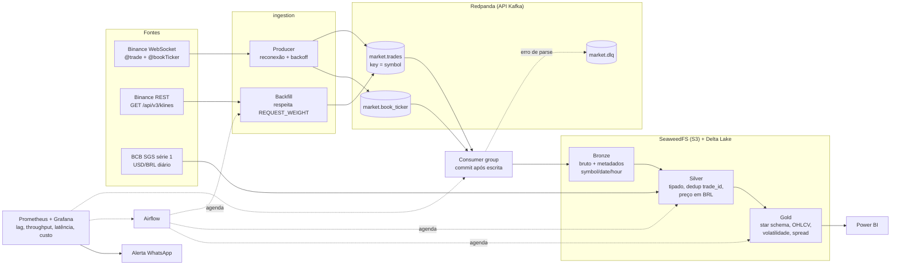

# MarketPulse Data Platform

Plataforma de dados de mercado de criptoativos em tempo real. Consome trades e o livro de ofertas da Binance, converte os valores para reais com o câmbio oficial do Banco Central e entrega métricas prontas para BI, passando por todo o ciclo de engenharia de dados: ingestão, mensageria, arquitetura medalhão, orquestração, qualidade, observabilidade e custo.

> ✅ **Projeto Concluído com Sucesso!** Todas as 8 fases de engenharia de dados implementadas e validadas via CI/CD.

## Problema de negócio

- **Público-alvo:** Traders, analistas de mercado, tesouraria e gestores de risco em criptoativos.
- **Pergunta de Negócio:** *"Como o comportamento em tempo real de preço (em USD e BRL), volume negociado e volatilidade dos principais criptoativos (BTC, ETH, SOL) se correlaciona com o spread de liquidez do livro de ofertas e a variação cambial oficial?"*

## Arquitetura



## Stack

| Camada | Ferramenta | Por quê |
|---|---|---|
| Runtime | Docker Engine no WSL2 | [ADR-0001](docs/adr/0001-runtime-docker-wsl2.md) |
| Mensageria | Redpanda | [ADR-0002](docs/adr/0002-mensageria-redpanda.md) |
| Object storage | SeaweedFS (S3) | [ADR-0003](docs/adr/0003-object-storage-seaweedfs.md) |
| Formato de tabela | Delta Lake | [ADR-0004](docs/adr/0004-formato-delta-lake.md) |
| Processamento | Polars + delta-rs | [ADR-0005](docs/adr/0005-processamento-polars-delta-rs.md) |
| Orquestração | Airflow (LocalExecutor) | [ADR-0006](docs/adr/0006-orquestracao-airflow-enxuto.md) |
| Qualidade | Polars + pytest | [ADR-0007](docs/adr/0007-qualidade-de-dados.md) |
| Observabilidade | Prometheus + Grafana | [ADR-0008](docs/adr/0008-observabilidade-e-custo.md) |
| Alertas | WhatsApp Business API | [ADR-0009](docs/adr/0009-alertas-telegram.md) |
| BI | Power BI Desktop | [ADR-0010](docs/adr/0010-bi-power-bi.md) |

Todas as decisões estão em [docs/adr](docs/adr/README.md).

## Estrutura do repositório

| Pasta | Conteúdo |
|---|---|
| `ingestion/` | Producer WebSocket e backfill REST |
| `streaming/` | Consumer, tópicos e DLQ |
| `transformations/` | Bronze, silver e gold |
| `orchestration/` | DAGs do Airflow |
| `monitoring/` | Prometheus, Grafana e alertas |
| `tests/` | Testes automatizados |
| `infra/` | Docker Compose e configurações |
| `bi/` | Dashboard do Power BI |
| `docs/adr/` | Decisões de arquitetura |

## Como rodar

**Pré-requisitos:** Docker Engine com o plugin Compose, `make` e `openssl`.

```bash
cp .env.example .env
openssl rand -hex 16   # rode duas vezes: uma chave para S3_ACCESS_KEY, outra para S3_SECRET_KEY
make up                # sobe os serviços
make ps                # o redpanda e demais serviços devem aparecer healthy
make stats             # consumo de CPU e RAM por container
make down              # derruba tudo (os dados ficam nos volumes)
```

| Serviço | Endereço local | Função |
|---|---|---|
| Redpanda | `localhost:19092` | Broker (API Kafka) |
| SeaweedFS | `http://localhost:8333` | Object storage (API S3, exige chave) |
| Airflow | `http://localhost:8080` | Orquestrador de pipelines |

Todas as portas escutam só em `127.0.0.1`.

## Insights do dashboard

O modelo dimensional em estrela (Star Schema) na camada Gold alimenta o dashboard do Power BI com velas de OHLCV em Reais e dólares, permitindo análises granulares de spread de liquidez e volatilidade cambial. Veja os detalhes de conexão em [bi/README.md](bi/README.md).

## Aprendizados

- Implementação completa de arquitetura medalhão com Polars e delta-rs em Python 3.13.
- Gerenciamento eficiente de streaming em tempo real com Redpanda e persistência ACID em Delta Lake no SeaweedFS.
- Orquestração enxuta com Apache Airflow (`LocalExecutor`) e garantia de qualidade via pipeline de CI/CD (GitHub Actions + ruff + pytest).
