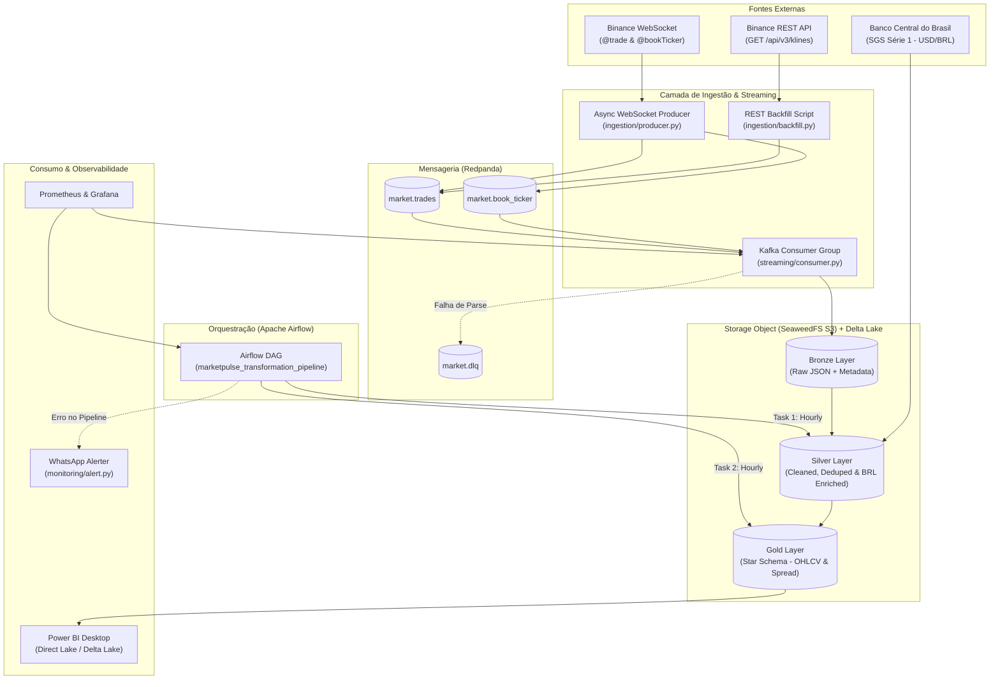
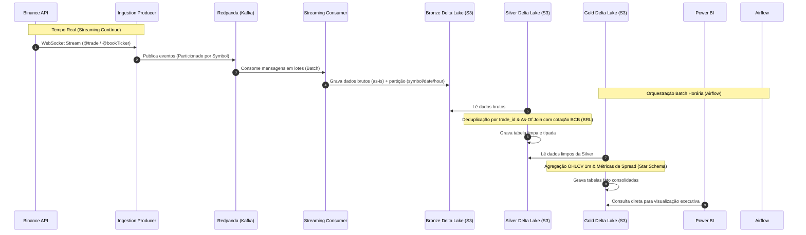
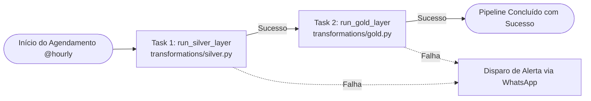

# Arquitetura e Fluxogramas do Sistema — MarketPulse Data Platform

Este documento apresenta os diagramas de arquitetura, fluxogramas de dados e topologia de componentes da **MarketPulse Data Platform**, estruturados sob os padrões de engenharia de dados de empresas globais de tecnologia.

---

## 1. Visão Geral da Arquitetura de Sistemas

O diagrama abaixo ilustra o ecossistema completo da plataforma, desde as fontes externas até o consumo final no BI, isolando as camadas de infraestrutura, mensageria, armazenamento e orquestração.



---

## 2. Fluxograma da Arquitetura Medalhão

O detalhamento de como os dados evoluem e são transformados de ponta a ponta:



---

## 3. Topologia das Tarefas no Apache Airflow

As dependências e o fluxo de execução horária gerenciados pelo Airflow (`LocalExecutor`):



---

## 4. Diagrama de Estados do Pipeline CI/CD (Quality Gate)

O fluxo de controle de qualidade e branches no GitHub:

```mermaid
stateDiagram-v2
    [*] --> FeatureBranch: Desenvolve na branch dev
    FeatureBranch --> PR: Abre Pull Request para main
    state CI <<fork>>
        PR --> CI: Dispara GitHub Actions (CI Quality Gate)
        CI --> Ruff: Executa linter (ruff check .)
        CI --> Pytest: Executa testes unitários (PYTHONPATH=. pytest)
    Ruff --> CheckFailed: Erro de estilo / imports
    Pytest --> CheckFailed: Teste quebrado
    Ruff --> CheckPassed: Sucesso
    Pytest --> CheckPassed: Sucesso
    CheckFailed --> [*]: Bloqueia Merge (Branch Protection)
    CheckPassed --> Merge: Aprova e realiza Merge na main
    Merge --> [*]
